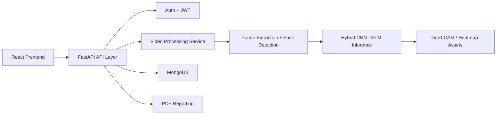

# AI-Based Deepfake Detection System Using Hybrid CNN-LSTM

A production-style full-stack deepfake detection platform built for academic submission, research prototyping, and portfolio showcase. The system combines a React analytics dashboard with a FastAPI backend and a Hybrid CNN-LSTM inference pipeline for classifying uploaded videos as `REAL` or `FAKE`.

## Highlights

- Full-stack architecture with React, Tailwind CSS, Framer Motion, FastAPI, and MongoDB
- JWT authentication with protected routes and role-aware admin endpoints
- Video processing pipeline with upload validation, ffmpeg compression, frame extraction, face detection, sequence generation, and inference
- Hybrid CNN-LSTM model architecture using EfficientNetB0 and Bidirectional LSTMs
- Explainable outputs including suspicious frames, heatmap-style visualizations, confidence scores, and per-frame detection timeline
- Admin analytics, user history, report generation, Dockerized deployment, and cloud-ready structure

## Architecture



## Project Structure

```text
frontend/            React + Tailwind + Framer Motion dashboard
backend/             FastAPI API, services, ML modules, tests
datasets/            Dataset placeholders and generated manifests
scripts/             Training and preprocessing entry scripts
docs/                API, training, deployment documentation
nginx/               Reverse proxy configuration
docker-compose.yml   Multi-service local orchestration
```

## Backend Features

- `POST /auth/signup`, `POST /auth/login`
- `POST /upload-video`, `POST /predict`
- `GET /history`, `DELETE /history/{id}`
- `GET /report/{id}`
- `GET /admin/stats`

Security controls include password hashing, JWT auth, file validation, CORS configuration, and API rate limiting.

## ML Pipeline

### Inference Steps

1. Upload video file
2. Compress with `ffmpeg`
3. Extract frames every `N` frames
4. Detect faces with `MTCNN`
5. Resize and normalize to `224x224`
6. Build a temporal frame sequence
7. Feed the sequence into EfficientNetB0 feature extractor
8. Process frame embeddings with Bidirectional LSTM layers
9. Return sigmoid probability, class label, suspicious frames, and explainability artifacts

### Training Design

- Transfer learning backbone: EfficientNetB0
- Temporal sequence model: stacked Bidirectional LSTMs
- Early stopping and checkpointing
- ReduceLROnPlateau scheduler
- TensorBoard logging
- Mixed precision enabled
- Optional ONNX export support via `tf2onnx`

## Datasets

Recommended datasets:

- FaceForensics++
- Celeb-DF
- DFDC

The repository includes dataset manifest tooling and a training entrypoint. For a real submission, connect the loaders to the actual dataset directories and replace the sample tensor generator in `backend/app/ml/train.py` with your preprocessed tensors or a `tf.data` pipeline.

## Frontend Experience

- Futuristic cybersecurity-inspired landing page
- Auth flows for login and registration
- Dashboard with stats and detection timeline
- Upload page with drag-and-drop style interaction
- Results page with confidence meter, suspicious frames, and heatmaps
- Analytics and history views
- Admin panel for high-level platform stats

## Quick Start

### 1. Configure environment

```bash
cp backend/.env.example backend/.env
cp frontend/.env.example frontend/.env
```

### 2. Run with Docker

```bash
docker compose up --build
```

### 3. Run locally without Docker

Backend:

```bash
cd backend
python -m venv .venv
source .venv/bin/activate
pip install -r requirements.txt
uvicorn app.main:app --reload
```

Optional model export dependencies:

```bash
pip install -r requirements-export.txt
```

Frontend:

```bash
cd frontend
npm install
npm run dev
```

## Notes for Academic Submission

- The backend currently supports a mock inference fallback when no trained model artifact is present.
- Swap `ENABLE_MOCK_MODEL=true` to `false` after placing a trained model at `backend/artifacts/models/cnn_lstm_best.keras`.
- ONNX export tools are kept in `backend/requirements-export.txt` so the default app install stays compatible with TensorFlow on local development machines.
- Real-world production hardening should add malware scanning, asynchronous job queues, Redis-backed rate limiting, signed object storage URLs, and a proper Grad-CAM implementation against the trained model.

## Documentation

- [API documentation](/Users/prachibhushan/DeepfakeDetectionSystem/docs/API.md)
- [Training guide](/Users/prachibhushan/DeepfakeDetectionSystem/docs/TRAINING.md)
- [Deployment guide](/Users/prachibhushan/DeepfakeDetectionSystem/docs/DEPLOYMENT.md)
